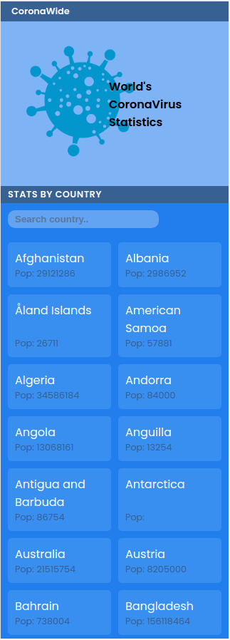
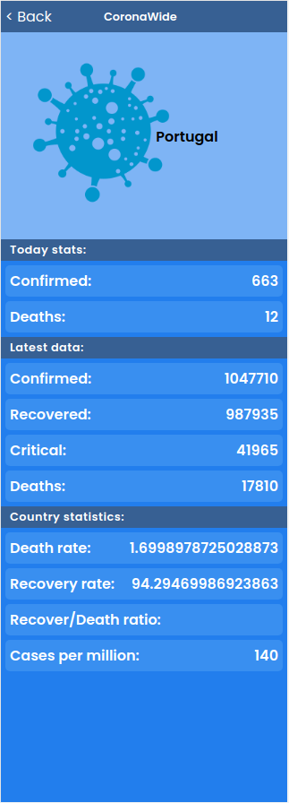

# CoronaWide

"CoronaWide" is a website that display the world statistics for covid-19.

It is a Single Page App (SPA) that allows users to:
    -> Search country to get up to date data about covid 19.
    -> Every country as is own further details

## Built With

- HTML5, CSS3
- JavaScript
- React
- Redux

## Live Demo

[Netlify](https://coronawide.netlify.app/)

## Getting Started

To get a local copy up and running follow these simple example steps.

### Setup

- Clone the repo `git clone git@github.com:Leandro-Barretoo/coin_mark.git`
- `cd` into the directory
- run `npm i` or `npm install` to download required node_modules
- open in your desired code editor
- run `npm start` to start live server

## Authors

👤 **Leandro Barreto**

- GitHub: [@Leandro-Barretoo](https://github.com/Leandro-Barretoo)
- LinkedIn: [Leandro Barreto](https://linkedin.com/in/leandroobarreto/)

## 🤝 Contributing

Contributions, issues, and feature requests are welcome!

Feel free to check the [issues page](../../issues/).

## Show your support

Give a ⭐️ if you like this project!

## Acknowledgments

- Hat tip to anyone whose code was used
- Inspiration
- etc

## 📝 License

This project is [MIT](./MIT.md) licensed.
